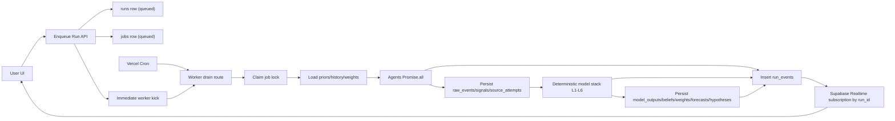

# Signal Engine Architecture (Sprint 0, Design Only)

## Scope
This document defines the TypeScript + Next.js + Supabase + Vercel architecture for Signal Engine while preserving product behavior, model semantics, and build order from the spec.

## Repository Layout
```text
.
+- app/
¦  +- (dashboard)/
¦  ¦  +- missions/
¦  ¦  +- runs/
¦  ¦  +- run/[runId]/
¦  +- api/
¦  ¦  +- missions/route.ts
¦  ¦  +- runs/enqueue/route.ts
¦  ¦  +- worker/drain/route.ts
¦  ¦  +- health/route.ts
¦  +- actions/
¦     +- createMission.ts
¦     +- enqueueRun.ts
+- lib/
¦  +- agents/
¦  ¦  +- filings/
¦  ¦  +- news/
¦  ¦  +- macro/
¦  ¦  +- demand/
¦  ¦  +- sentiment/
¦  ¦  +- gov-reg/
¦  ¦  +- innovation/
¦  +- model-stack/
¦  ¦  +- l1-normalize.ts
¦  ¦  +- l2-time-dynamics.ts
¦  ¦  +- l25-cusum.ts
¦  ¦  +- l3-cross-signal.ts
¦  ¦  +- l4-bayes.ts
¦  ¦  +- l5-composite.ts
¦  ¦  +- l6-package.ts
¦  +- orchestrator/
¦  ¦  +- mission-planner.ts
¦  ¦  +- agent-selector.ts
¦  ¦  +- run-orchestrator.ts
¦  +- storage/
¦  ¦  +- repositories/
¦  ¦  +- migrations/
¦  ¦  +- sql/
¦  +- llm/
¦  ¦  +- llm-client.ts
¦  ¦  +- gemini-client.ts
¦  ¦  +- openai-client.ts
¦  ¦  +- numeric-validator.ts
¦  +- realtime/
¦  ¦  +- run-events.ts
¦  +- jobs/
¦  ¦  +- queue.ts
¦  ¦  +- claim.ts
¦  ¦  +- backoff.ts
¦  ¦  +- slices.ts
¦  +- auth/
¦     +- server-client.ts
¦     +- rls-context.ts
+- docs/
+- supabase/
   +- migrations/
```

## Module Boundaries
- `agents/*`: fetch from free/open sources, normalize into `Signal[]`, return `AgentResult`. Agents never compute composite/confidence.
- `orchestrator/*`: parse mission intent, select agents, dispatch in parallel, coordinate persistence, invoke deterministic model stack.
- `model-stack/*`: only deterministic math. All numbers in outputs originate here.
- `storage/*`: all reads/writes for runs, events, signals, beliefs, weights, forecasts, hypotheses, cache/rate limits/jobs.
- `llm/*`: provider abstraction + structured extraction + narrative synthesis + numeric hallucination gate.
- `realtime/*`: append `run_events` rows with spec-compatible event kinds and payload columns.
- `jobs/*`: queue lock/claim/retry and bounded-slice execution orchestration.

## Code-Level Run Lifecycle (Spec §15 mapped to jobs + Realtime)
1. User submits mission/run request to `POST /api/runs/enqueue`.
2. API writes `runs` seed row (`status='queued'`) and `jobs` row (type=`run_pipeline`, payload includes run_id and user_id).
3. API triggers immediate drain attempt (`POST /api/worker/drain`) and cron also invokes drain every short interval.
4. Worker claims one job atomically (`status='running'`, set `locked_at`, increment attempts).
5. Worker loads mission config, prior run, beliefs (belief key), effective weights, trailing signal history.
6. Worker dispatches selected agents via `Promise.all` and captures per-agent `AgentResult`.
7. Worker persists `raw_events`, `signals`, `source_attempts`, and emits `run_events` milestones.
8. Worker executes model stack L1 ? L2 ? L2.5 ? L3 ? L4 ? L5 ? L6; each layer appends trace entries.
9. Worker persists `model_outputs`, updated `beliefs`, updated `weights`, `forecasts`, `hypotheses`.
10. Worker emits `run_events` `done`, marks `runs.status='completed'`, job `status='succeeded'`.
11. If invocation budget is exceeded mid-pipeline, worker checkpoints phase and re-enqueues continuation job.

## Architecture Diagram


## Non-Negotiable Enforcement
- Deterministic math owns all statistics, scores, ranges, confidence.
- LLM numbers are validated against `allowed_numbers` before user-facing output.
- Missing sources reduce confidence through explicit penalty, never crash entire run.
- Every layer appends to `Signal.trace`; final explanation is trace-derived.
